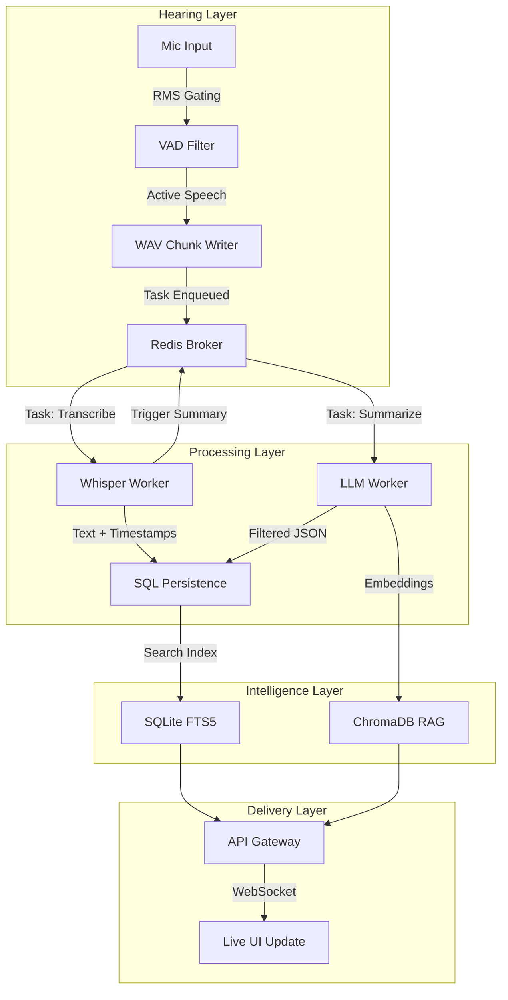
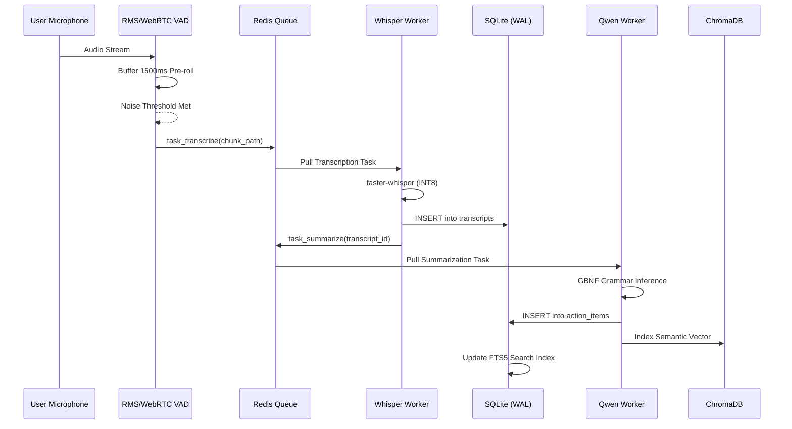

# Project Echo: Distributed Meeting Intelligence System

### Tech Stack: Python | FastAPI | Whisper | Qwen2 | Docker | Redis | ChromaDB | SQLite

Project Echo is a high-performance, privacy-centric meeting assistant designed for fully local execution. It utilizes a distributed architecture to decouple audio capture from intensive AI inference, ensuring low-latency processing even on hardware with limited resources.

---

## System Design and Architecture

Echo is engineered as a distributed, event-driven cluster. The system decouples the capture phase from the inference phase, allowing it to scale across multiple nodes while maintaining a minimal footprint on the recording hardware.

### System Architecture Overview


---

## Technical Workflow

The following sequence diagram details the lifecycle of a captured audio segment within the Echo ecosystem:



---

## Core Features and Implementation

### Optimized Audio Gating
Echo implements a dual-stage voice activity detection system to ensure high-quality captures while reducing wasted compute.
*   **RMS Energy Gating**: Initial filtering using RMS power levels to ignore background hum and static.
*   **WebRTC VAD**: Precision cadence detection to identify human speech patterns.
*   **Temporal Buffering**: Implementation of 1500ms pre-roll and 2000ms post-roll buffers to prevent word clipping.

### Distributed AI Inference
*   **Speech-to-Text**: Integration of faster-whisper (Base model) optimized for CPU-only environments.
*   **Action Item Extraction**: Utilization of Qwen2-0.5B (GGUF) with strict GBNF grammar enforcement to guarantee structured JSON output.
*   **Metadata Lineage**: Every generated action item is linked to its source transcript ID and original audio timestamp for full auditability.

### Semantic Memory and Search
*   **Full-Text Search (FTS5)**: Integrated SQLite search engine for rapid keyword retrieval.
*   **RAG (Retrieval Augmented Generation)**: Semantic memory layer using ChromaDB, allowing for conceptual queries that go beyond simple keyword matching.

### Resilience and Scalability
*   **Fault Isolation**: Decoupled deployment using Docker Compose; failures in the LLM worker do not impact the STT or API layers.
*   **Persistence Layer**: SQLite configured with Write-Ahead-Logging (WAL) for high concurrency.
*   **Task Reliability**: Redis-backed task queue with visibility timeouts to ensure zero data loss during process crashes.

---

## Deployment and Usage

### Containerized Deployment
Deploy the entire cluster including Redis, API Gateway, and specialized workers:
```bash
docker-compose up -d
```

### Interactive Test Mode
Run the real-time AI engine directly in your terminal for immediate verification:
```bash
python3 runners/interactive_test.py
```
*Note: Type /voice to trigger a 5-second capture.*

### API Interface
The Echo API is secured via X-API-Key and provides the following v1 endpoints:
*   **Session Control**: POST /api/v1/control/start
*   **Data Retrieval**: GET /api/v1/data/transcripts
*   **Keyword Search**: GET /api/v1/data/search?q=query
*   **Semantic Query (RAG)**: POST /api/v1/rag/ask
*   **Real-time Streaming**: WS /api/v1/stream/meetings/{id}

---

## Performance Evaluation

| Metric | Result | Environment |
| :--- | :--- | :--- |
| **STT Real-Time Factor** | 0.4x | Standard CPU |
| **LLM Inference Speed** | 12 tokens/sec | Standard CPU |
| **VAD Latency** | < 10ms | Real-time |
| **RAM Footprint** | ~1.2 GB | Peak Usage |

---

Project Echo - Advanced Agentic Engineering.
Developed by Hammad Munir.
